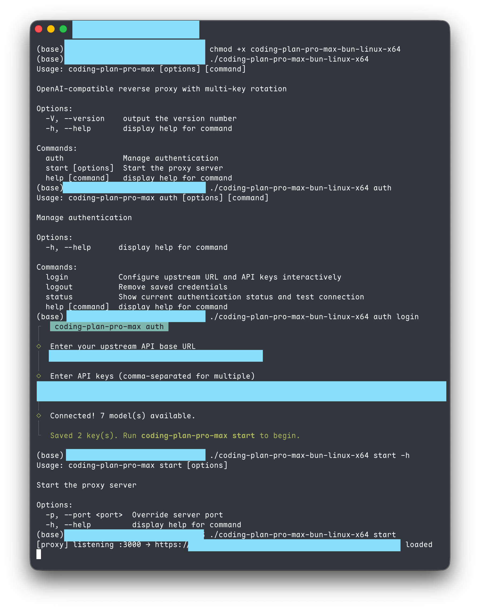
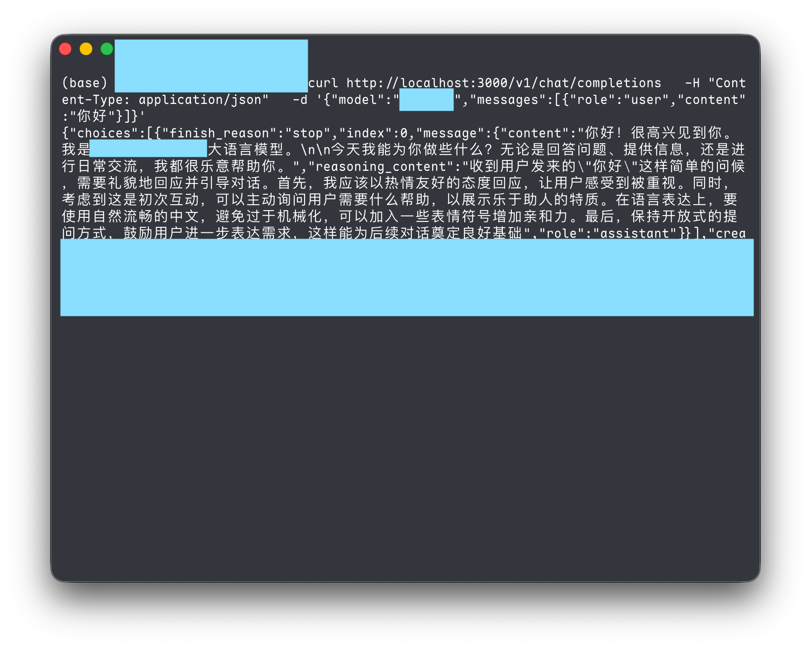

# coding-plan-pro-max

> ⚠️ **Disclaimer**: This is a personal learning project built while studying [opencode](https://github.com/anomalyco/opencode). Not intended for production use.

An OpenAI-compatible reverse proxy with **multi-key rotation** and an interactive CLI.

## Demo

<p align="center">
  
  
</p>

`coding-plan-pro-max auth login` → enter your upstream URL and API keys → `coding-plan-pro-max start` → done. The proxy forwards standard `/v1/chat/completions` requests to any OpenAI-compatible upstream, with automatic key rotation on quota exhaustion.

## Quick Start

```bash
# 1. Install
npm install

# 2. Authenticate (interactive — prompts for URL and keys)
npx tsx src/index.ts auth login

# 3. Start the proxy
npx tsx src/index.ts start

# Or after building:
npm run build
npm start          # runs "node dist/index.js start"
```

## CLI Commands

```
coding-plan-pro-max auth login    Configure upstream URL and API keys interactively
coding-plan-pro-max auth logout   Remove saved credentials
coding-plan-pro-max auth status   Show current auth state and test connection
coding-plan-pro-max start         Start the proxy server
coding-plan-pro-max --help        Show help
```

## Configuration

### Interactive (recommended)

```bash
coding-plan-pro-max auth login
# Prompts for:
#   1. Upstream API base URL
#   2. API keys (comma-separated for multiple)
# Validates connection, saves to ~/.config/coding-plan-pro-max/credentials
```

### Environment Variables (CI / automation)

| Variable | Required | Description |
|----------|----------|-------------|
| `API_KEY` | Yes* | One or more API keys, comma-separated |
| `UPSTREAM_BASE_URL` | Yes* | Upstream API base URL |
| `PORT` | No | Server port (default `3000`, range 1–65535) |
| `COOLDOWN_MS` | No | Cooldown per exhausted key (default `18000000` = 5h) |
| `MAX_PARALLEL` | No | Max concurrent upstream requests (default `4`) |

\* Required unless set via `coding-plan-pro-max auth login`.

### Resolution Order

1. Environment variables (highest priority — CI/CD)
2. Credentials file (`~/.config/coding-plan-pro-max/credentials`)
3. `.env` file in current directory (backward compat)
4. Defaults

### Credential Storage

Credentials are stored at `~/.config/coding-plan-pro-max/credentials` (JSON, file mode `0600`). Keys are never logged or exposed in API responses (health endpoint shows only the first 8 characters).

### Supported Providers

See **[PROVIDERS.md](PROVIDERS.md)** for a full list of Coding Plan API base URLs from major providers (Zhipu, Doubao, DeepSeek, Kimi, SiliconFlow, OpenRouter, OpenAI, Anthropic, Google, Qwen, MiniMax).

## Multi-Key Rotation

When multiple API keys are configured, the proxy:

1. **Round-robin** — distributes requests across keys evenly.
2. **Auto-rotation on quota exhaustion** — HTTP 429 or 403 with quota keywords → key goes on cooldown, next key is tried.
3. **Cooldown recovery** — after `COOLDOWN_MS`, the key becomes available again.
4. **503 when all exhausted** — every key on cooldown → `503` + `proxy_error`.

## Concurrency

Requests are processed through a bounded pool. `MAX_PARALLEL` (default `4`) controls how many upstream calls run simultaneously. Excess requests queue and are dispatched as slots free up.

## API Endpoints

| Method | Path | Description |
|--------|------|-------------|
| `GET` | `/` | Health check + key pool status |
| `GET` | `/v1/models` | List models (proxied from upstream) |
| `POST` | `/v1/chat/completions` | Chat completion (streaming and non-streaming) |

Provider prefixes are auto-stripped: `provider/model-name` → `model-name`.

### OpenAI SDK Usage

```python
from openai import OpenAI

client = OpenAI(
    api_key="any-value",  # proxy injects the real key
    base_url="http://localhost:3000/v1",
)

response = client.chat.completions.create(
    model="model-name",
    messages=[{"role": "user", "content": "Hello"}],
    stream=True,
)
```

## Scripts

```bash
npm run dev          # Dev server with hot reload
npm run build        # Compile TypeScript → dist/
npm start            # Run compiled CLI
npm run typecheck    # Type-check only
```

## Testing

```bash
# Start the server, then:
./test.sh                # default http://localhost:3000
./test.sh http://host:port  # custom address
```

## Architecture

```
src/
  index.ts           CLI entry (commander)
  credentials.ts     Credential storage (XDG path, chmod 600)
  config.ts          Config loading (env > credentials > .env > defaults)
  server.ts          Hono app + graceful shutdown
  key-pool.ts        Round-robin key selection, cooldown tracking
  proxy.ts           Request handlers with retry logic
  commands/
    auth-login.ts    Interactive auth setup
    auth-logout.ts   Clear credentials
    auth-status.ts   Show connection status
    start.ts         Start proxy server
```

Request flow:

```
Client → /v1/chat/completions
       → validate input
       → strip model prefix
       → pick key from pool
       → forward to upstream with Bearer token
       → on 429/403-quota: mark key exhausted, retry with next key
       → pipe response (SSE or JSON) back to client
```

## Error Responses

All errors follow OpenAI format: `{ "error": { "message", "type" } }`

| Status | Type | Cause |
|--------|------|-------|
| 400 | `invalid_request_error` | Missing/invalid `model`, empty `messages`, malformed JSON |
| 502 | `proxy_error` | Upstream unreachable or returned empty body |
| 503 | `proxy_error` | All API keys exhausted (all in cooldown) |

## License

[Apache-2.0](LICENSE)
